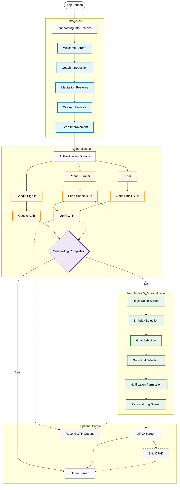

# Level SuperMind Onboarding Module Documentation

## Overview

The onboarding module manages the user's initial experience with the Level SuperMind app, including introduction screens, authentication, user personalization, and initial content recommendations. This documentation provides a comprehensive overview of the onboarding flow, architecture, key components, and implementation details.

## Table of Contents

1. [Onboarding Flow Chart](#onboarding-flow-chart)
2. [Module Structure](#module-structure)
3. [Screen-by-Screen Breakdown](#screen-by-screen-breakdown)
4. [Key Components](#key-components)
5. [State Management](#state-management)
6. [Authentication Flow](#authentication-flow)
7. [Analytics Implementation](#analytics-implementation)
8. [Permission Handling](#permission-handling)
9. [Common Issues and Solutions](#common-issues-and-solutions)
10. [Dependencies](#dependencies)

## Onboarding Flow Chart



## Module Structure

The feature-onboarding module is structured as follows:

```
feature-onboarding/
├── build.gradle.kts                    # Module-specific build configuration
├── src/
│   ├── main/
│   │   ├── AndroidManifest.xml         # Module manifest
│   │   ├── java/level/game/feature_onboarding/
│   │   │   ├── data/                   # Data layer
│   │   │   │   ├── OnboardingApiService.kt      # API service interface
│   │   │   │   ├── OnboardingRepoImpl.kt        # Repository implementation
│   │   │   │   └── OnbQuestionRequest.kt        # Request models
│   │   │   ├── di/                    # Dependency injection
│   │   │   │   └── OnboardingModule.kt          # DI module configuration
│   │   │   ├── domain/                # Domain layer
│   │   │   │   ├── OnboardingQuestions.kt       # Domain models
│   │   │   │   ├── OnboardingRepo.kt            # Repository interface
│   │   │   │   └── SignInResult.kt              # Auth result models
│   │   │   ├── events/                # Event handling
│   │   │   │   ├── OnboardingEvents.kt          # Event definitions
│   │   │   │   └── OnboardingState.kt           # State data class
│   │   │   └── presentation/          # UI layer
│   │   │       ├── GoogleAuthUIClient.kt        # Google auth implementation
│   │   │       ├── OnboardingGetStartedScreen.kt # Introduction screen
│   │   │       ├── OnboardingInformationScreen.kt # Info screens
│   │   │       ├── OnboardingNavigation.kt      # Navigation setup
│   │   │       ├── OnboardingSignInOptionsScreen.kt # Auth options
│   │   │       ├── OnboardingUserDetailsScreen.kt  # User details
│   │   │       ├── OnboardingVerifyOtpScreen.kt   # OTP verification
│   │   │       ├── OnboardingViewModel.kt        # Main ViewModel
│   │   │       └── OnbDfadScreen.kt              # First activity screen
```

## Screen-by-Screen Breakdown

### 1. Introduction Screens
**File:** `OnboardingInformationScreen.kt`
**Entry Point:** `OnboardingParent` -> `Screens.OnbFirstInfoScreen`

The introduction consists of 5 screens showcasing the app's main features:

1. **Welcome Screen:** Introduction to Level SuperMind
2. **Coach Introduction:** Showcases the app's coaches
3. **Meditation Features:** Highlights meditation capabilities
4. **Workout Benefits:** Explains workout integration
5. **Sleep Improvement:** Details sleep improvement features

Each screen uses animations and graphics to engage users. The screen automatically advances after a set delay, but users can also manually navigate.

**Key Implementation Notes:**
- Uses HorizontalPager with auto-scrolling feature
- Animated content transitions
- Tracks page visits via the `eventHelper`
- Uses Lottie animations for dynamic elements

### 2. Authentication Options
**File:** `OnboardingSignInOptionsScreen.kt`
**Entry Point:** `Screens.OnbLoginOptions`

Users can sign in through:
- Email
- Phone number
- Google Authentication

**Key Implementation Notes:**
- Country detection (`getCountryFromIP()`) to set default authentication method
- Tab-based UI for switching between authentication methods
- Input validation for email and phone numbers
- Integration with Google Authentication

**Authentication Methods:**
- **Email:** Validates format, sends OTP via API
- **Phone:** Uses country code picker, validates number, sends OTP
- **Google:** Uses GoogleAuthUIClient to trigger Google authentication

### 3. OTP Verification
**File:** `OnboardingVerifyOtpScreen.kt`
**Entry Point:** `Screens.OnbVerifyOtpScreen`

Verifies user identity via one-time password (OTP):

- OTP is sent to email or phone
- User enters the code
- Support for resending OTP via different channels (SMS/WhatsApp/Call)
- Automatic SMS detection when possible

**Key Implementation Notes:**
- Uses `MySMSBroadcastReceiver` for auto-detection of SMS OTPs
- Countdown timer for resend limitations
- Multiple resend options for phone verification
- JWT-based token for secure verification

### 4. User Details Collection
**File:** `OnboardingUserDetailsScreen.kt`
**Entry Point:** `Screens.OnbUserDetailsScreen`

Collects essential user information:
- Name (required)
- Secondary contact method (email/phone)
- Gender selection
- Marketing preferences
- Terms and conditions acceptance
- Optional referral code

**Implementation Notes:**
- Progressive disclosure UI with linear progress indicator
- Real-time input validation
- Proper keyboard handling
- Backend validation via API calls

### 5. Birthday Selection
**File:** `OnboardingUserDetailsScreen.kt` (part of `OnboardingDatePicker` composable)

Custom date picker for selecting user's birth date:
- Wheel picker style interface
- Range validation
- Optional skip functionality

**Implementation Notes:**
- Custom date picker implementation (`HighlightedLevelTimePicker`)
- Date validation with `onbDateValidator()`
- Age-appropriate year range (100 years ago to 3 years ago)

### 6. Goal Selection
**File:** `OnboardingUserDetailsScreen.kt` (part of `OnboardingGoalQuestions` composable)

Users select their primary goals from options:
- Visual goal cards with images
- Multiple selection support
- Priority ordering

**Implementation Notes:**
- Fetches goals from API via `getOnbGoals()`
- Uses `OnboardingPriorityCard` components
- Supports multiple goal selection with priority indication

### 7. Sub-Goal Selection
**File:** `OnboardingUserDetailsScreen.kt` (parts: `OnboardingSubGoalQuestions` and `OnboardingExpandingQuestions`)

More specific preferences based on the primary goal:
- Adaptive UI based on goal type
- Special flows for specific goal types (e.g., mantra meditation)
- Detailed descriptions of each option

**Implementation Notes:**
- Dynamic UI based on selected goal type
- Different UI for mantra goals vs. other goals
- Visual highlighting of selected options

### 8. Notification Permission
**File:** `OnboardingUserDetailsScreen.kt` (part of `OnboardingNotification` composable)

Requests notification permission with context:
- Visual explanation of benefits
- Permission request using system dialog
- Graceful handling if denied

**Implementation Notes:**
- Uses `RuntimePermissionHelper` for permission handling
- Different flows for Android 13+ (with POST_NOTIFICATIONS) vs older versions
- Analytics tracking for permission responses

### 9. Personalization Loading
**File:** `OnboardingUserDetailsScreen.kt` (part of `OnboardingPersonaliseScreen` composable)

Visual loading screen showing personalization progress:
- Animated progress indicator
- Sequential task completion messaging
- Success animation on completion

**Implementation Notes:**
- Animated progress indicator with timed progression
- Sequential reveal of completed personalization steps
- Lottie animation for success state

### 10. First Activity (DFAD Screen)
**File:** `OnbDfadScreen.kt`

Introduces the user's first recommended activity:
- Activity preview with details
- Start or skip options
- Coach attribution when applicable

**Implementation Notes:**
- Uses activity recommendation from API response
- Two-screen approach (preview and detail)
- Skip flow with secondary encouragement screen

## Key Components

### ViewModel
**File:** `OnboardingViewModel.kt`

Central component managing the onboarding state and business logic:

- Handles all user interaction events via `onEvent()`
- Manages API interactions through the repository
- Tracks and updates onboarding state
- Handles authentication flows
- Manages user data persistence

**Key Functions:**
- `onEvent(events: OnboardingEvents)`: Event handling dispatcher
- `triggerOnboardingEvent()`: Sends analytics for onboarding completion
- `determineOnboardingScreen(user: User)`: Logic to determine screen based on user state
- Various API call methods for each onboarding step

### State Management
**File:** `OnboardingState.kt`

Data class containing all state related to onboarding:

```kotlin
data class OnboardingState(
    val isValidPhone: Boolean = false,
    val isValidEmail: Boolean = false,
    val isValidName: Boolean = false,
    val totalScreen: Int = 1,
    val customiseScreenNum: Int = 1,
    val countryCode: String = "",
    val phoneNumber: String = "",
    val emailId: String = "",
    // Additional state properties...
)
```

### Events
**File:** `OnboardingEvents.kt`

Sealed interface defining all possible user interactions:

```kotlin
sealed interface OnboardingEvents {
    data class OnPhoneNumberChange(val phoneNumber: String, val countryCode: String): OnboardingEvents
    data class OnEmailIdChange(val emailId: String): OnboardingEvents
    // Additional event types...
}
```

### Repository
**Files:** `OnboardingRepo.kt` (interface), `OnboardingRepoImpl.kt` (implementation)

Handles all API interactions for the onboarding process:

**Key Methods:**
- `sendOtpPhone(jwtToken: String): Resource<SendOTPResponse>`
- `verifyEmailOtp(jwtToken: String): Resource<UserLoginResponse>`
- `saveOnboardingDetails(jwtToken: String): Resource<OnboardingResponse>`
- Additional API methods...

### Navigation
**File:** `OnboardingNavigation.kt`

Sets up the navigation graph for the onboarding flow using Jetpack Navigation:

```kotlin
fun NavGraphBuilder.onboardingNavigation(
    eventHelper: EventHelper,
    navController: NavHostController,
    areOnboardingTagsSaved: Boolean,
) {
    navigation<Screens.OnboardingParent>(
        startDestination = Screens.OnbFirstInfoScreen,
    ) {
        // Screen destinations defined here...
    }
}
```

## State Management

The onboarding module uses a unidirectional data flow pattern:

1. **State:** Centralized in `OnboardingState` data class
2. **Events:** User actions defined in `OnboardingEvents` sealed interface
3. **ViewModel:** Processes events, updates state, triggers side effects
4. **UI:** Renders based on current state and sends events

**State Flow:**
```
User Action → OnboardingEvents → ViewModel.onEvent() → Repository API Calls → State Update → UI Recomposition
```

**State Updates Example:**
```kotlin
_onboardingState.update {
    it.copy(
        emailId = events.emailId,
        isValidEmail = checkValidity.isValidEmail(events.emailId)
    )
}
```

## Authentication Flow

The app supports three authentication methods:

### 1. Phone Authentication
**Key Files:** `OnboardingSignInOptionsScreen.kt`, `OnboardingVerifyOtpScreen.kt`

1. User enters phone number with country code
2. Validation occurs client-side
3. OTP is requested via API
4. User enters OTP
5. OTP is verified via API
6. User proceeds to next step or home screen

### 2. Email Authentication
**Key Files:** `OnboardingSignInOptionsScreen.kt`, `OnboardingVerifyOtpScreen.kt`

Similar to phone flow but uses email instead.

### 3. Google Authentication
**Key Files:** `GoogleAuthUIClient.kt`, `OnboardingNavigation.kt`

1. User taps Google sign-in button
2. Google authentication intent is launched
3. Result is processed in `OnboardingNavigation.kt`
4. Token is sent to backend
5. User proceeds based on onboarding status

**JWT Security:**
Authentication uses JWT tokens for secure API communication:

```kotlin
val jwtToken = jwtBuilder.createJwt(
    mapOf(
        "session_id" to _onboardingState.value.sessionId,
        "otp" to events.otp,
        "email" to (_onboardingState.value.emailId ?: ""),
        // Additional claims...
    ),
    useUserId = false,
    useAuthToken = false
)
```

## Analytics Implementation

Analytics are tracked throughout the onboarding flow using `EventHelper`:

**Screen Visits:**
```kotlin
eventHelper.pageVisitEvent(
    PgOnbRegistration,
    if (previousScreen == 2) {
        PgOnbBirthday
    } else {
        imFrom
    }
)
```

**Button Clicks:**
```kotlin
eventHelper.buttonClickedEvent(
    btnContinue,
    PgOnbBirthday,
    date
)
```

**Permissions:**
```kotlin
eventHelper.permissionEvent(
    imFrom = EventsConstants.PgOnbNotification,
    type = EventsConstants.PermNotification,
    status = EventHelper.PermissionStatus.Allow
)
```

**Completion Events:**
```kotlin
eventHelper.onboardingCompletedEvent()
```

## Permission Handling

Notification permissions are requested during onboarding:

```kotlin
val notificationPermissionHelper = rememberPermissionHelper(
    permissions = permissionsToRequest,
    onPermissionDenied = {
        // Handle denial
    },
    onPermissionGranted = {
        // Handle acceptance
    },
    onShouldShowRationale = {
        // Show explanation
    }
)
```

- For Android 13+ (API 33+): Requests POST_NOTIFICATIONS permission
- For older versions: No runtime permission needed
- Analytics track permission acceptance/denial

## Common Issues and Solutions

### 1. OTP Not Received
- Check correct phone/email was entered
- Verify SMS permissions
- Try alternative delivery methods (call, WhatsApp)
- Inspect API response codes in logs

### 2. Google Sign-In Fails
- Verify Google Play Services is up to date
- Check Google client ID in `GoogleAuthUIClient.kt`
- Inspect Logcat for Google Sign-In errors
- Verify internet connectivity

### 3. Country Detection Issues
- Default to email if IP detection fails
- Check `getCountryFromIP()` implementation
- Fallback handling in `OnboardingSignInOptionsScreen.kt`

### 4. Navigation Errors
- Check for missing route parameters
- Verify popUpTo behavior in navigation calls
- Inspect BackHandler implementations

## Dependencies

The onboarding module has the following key dependencies:

```kotlin
dependencies {
    // Firebase for analytics
    firebase()

    // Google authentication
    googleAuth()
    googlePhoneApi()

    // UI components
    compose()

    // Dependency injection
    hilt()

    // Networking
    retrofit()

    // Animations
    lottie()

    // Internal modules
    levelDeeplinks()
    levelCountryCodePicker()
    levelCoreUi()
    levelResources()

    // Additional dependencies...
}
```

### Third-Party Libraries:
- **Retrofit**: API communication
- **Hilt**: Dependency injection
- **Compose**: UI framework
- **Lottie**: Animations
- **Google Auth**: Authentication support

### Internal Dependencies:
- **level-core-ui**: Shared UI components
- **level-resources**: Shared resources
- **level-country-code-picker**: Phone code selection UI
